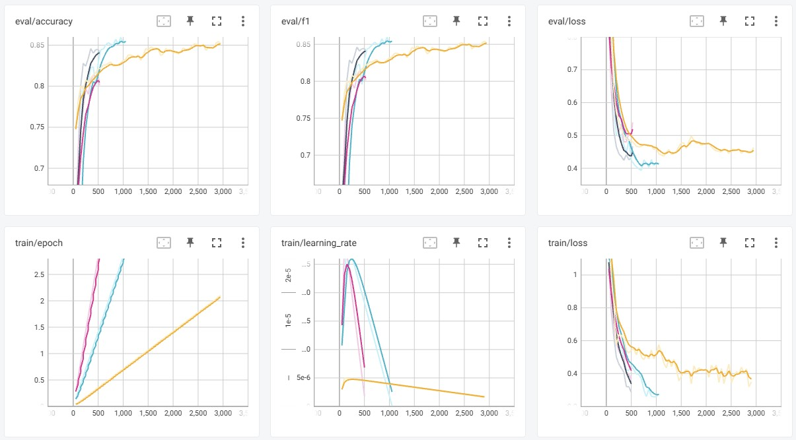

# MedNLI-Transformer

NLI task in Transformer models with MedNLI dataset

read [report](./docs/report.pdf)

## Dataset

### [MedNLI](https://physionet.org/content/mednli/1.0.0/)

- A Natural Language Inference Dataset for Clinical Domain
  - NLI task (3 labels)
  - Based on MIMIC-III 2M clinical notes
- Size
  - Train: 11,232
  - Development: 1,395
  - Test: 1,422

## Models

from [HuggingFace](https://huggingface.co/models)

### BERT

pre-trained with Biomedical datasets

### RoBERTa

### DeBERTa-V3

Pre-trained with NLI datasets

## Results

| run_name | eval_loss | eval_accuracy | eval_precision | eval_recall | eval_f1 |
|-|-|-|-|-|-|
| nli-deberta-v3-base| 0.464043 | 0.851617 | 0.852126 | 0.851617 | 0.851417 |
| deberta-v3-base | 0.430728 | 0.843179 | 0.842684 | 0.843179 | 0.842889 |
| BiomedNLP-PubMedBERT-base-uncased-abstract-fulltext | 0.467523 | 0.841069 | 0.842066 | 0.841069 | 0.84144 |
| stsb-roberta-base-v2 | 0.539905 | 0.800985 | 0.801805 | 0.800985 | 0.801239 |

